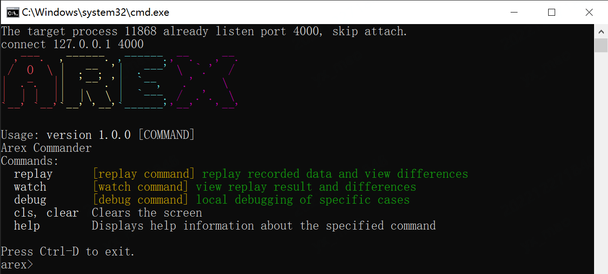

#  AREX's Standalone Mode

## Introduction

Start using arex quickly in local mode, no need to build storage service or other service separately. 

The project includes two modules:

***1. arex-cli:***

command line control interface, through which the local application with [arex-agent-java](https://github.com/arextest/arex-agent-java) attached can be replayed

***2. arex-local:***

uses [H2](https://www.h2database.com) as a local storage to save the recorded data


## Getting Started


download the latest binary and compile it by yourself:

```other
mvn install
```

Put the `arex-local/target/arex-local-<version>.jar` package into the `arex-agent-jar/extensions` directory (create a new folder if there is no extensions).

Remember to add the VM parameter when the local application starts the arex-agent-java: 

`-Darex.storage.mode=local`


Simply click the script in the `arex-standalone/bin` directory to start the command line tool, or run it by following `java` command:

```other
java -jar "/path/to/arex-cli/target/arex-cli.jar"
```

Dashboard


The supported commands are as follows:


- **replay**- replay recorded data and view differences

  `[option: -n/--num]` replay numbers, default the latest 10


- **watch**- view replay result and differences

  `[option: -r/--replayId]` replay id, multiple are separated by spaces


- **debug**- local debugging of specific cases

  `[option: -r/--recordId]` record id, required Option


## License
- Code: [Apache-2.0](https://github.com/arextest/arex-agent-java/blob/main/LICENSE)
