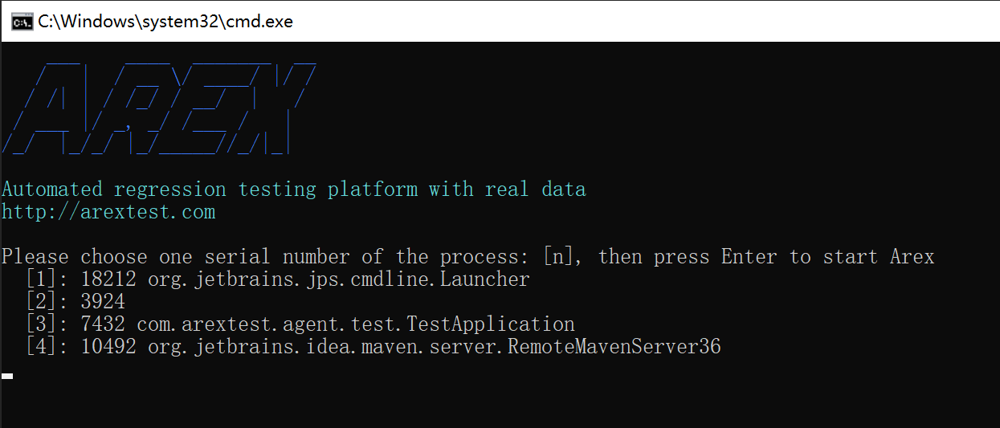
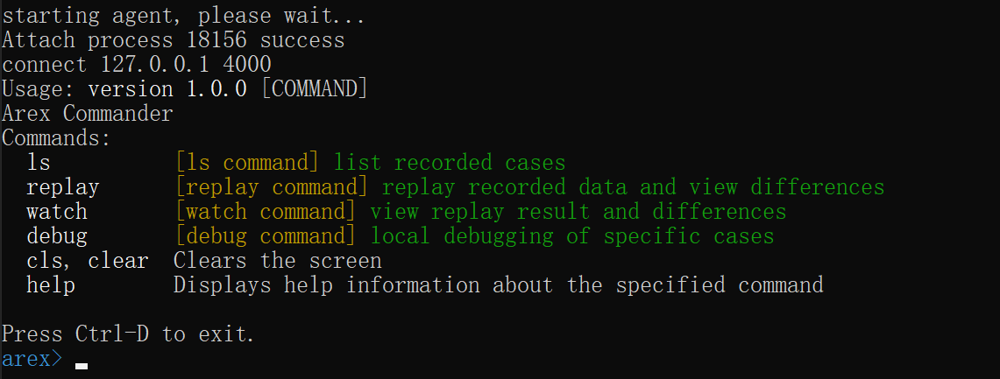
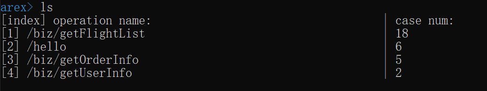
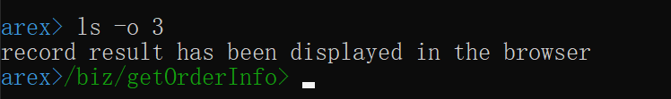
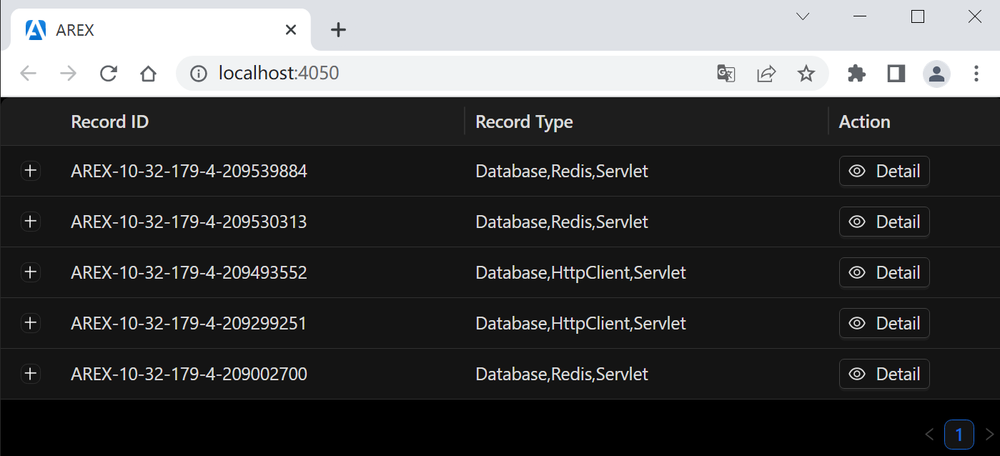
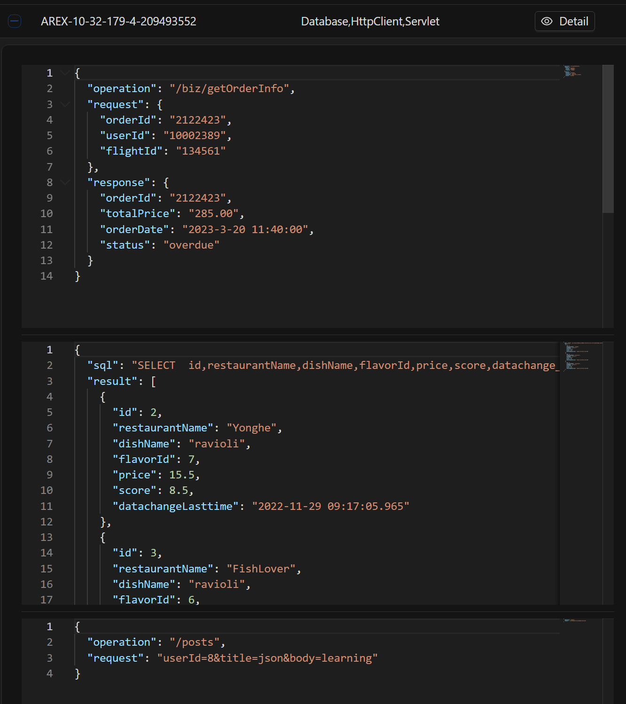
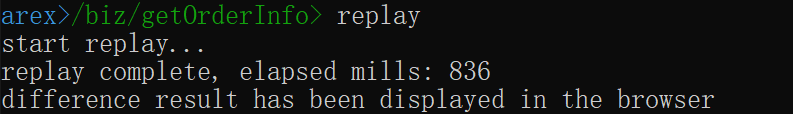
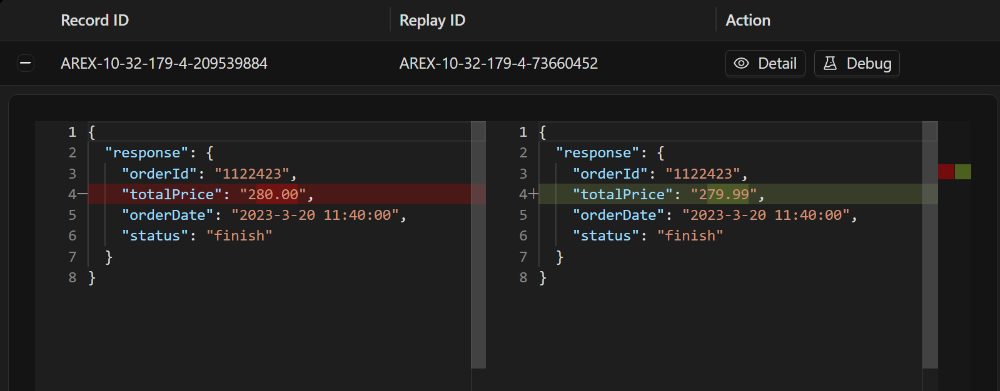
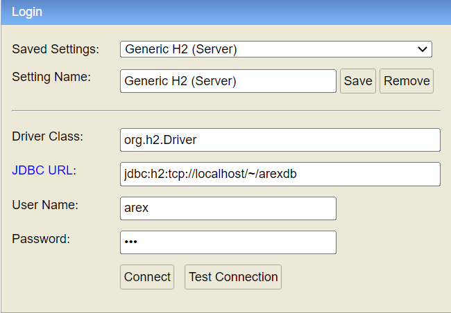

#  AREX's Standalone Mode

## Introduction

Start using arex quickly in local mode, no need to build storage service or other service separately. 

The project mainly includes two modules:

- **arex-cli**

  command line control interface, through which the local application with 
  [arex-agent-java](https://github.com/arextest/arex-agent-java) attached can be replayed

- **arex-local**

  uses [H2](https://www.h2database.com) as a local storage to save the record data and replay data


## Getting Started

***1. download arex-standalone-all.zip***

Download the `arex-standalone-all.zip` file from the **Assets** directory on the 
[releases](https://github.com/arextest/arex-standalone/releases/latest) page and decompress 
**or** you can access [Gitee](https://gitee.com/arextest/arex-standalone/releases) images 
and synchronize periodically.
> Alternatively, download the source code locally and compile (`mvn clean install`), 
> replacing the corresponding jar package in the arex-standalone-all folder,
> The prerequisite is first to compile the agent project:[arex-agent-java](https://github.com/arextest/arex-agent-java) locally, 
> execute command: `mvn clean install -DskipTests` (deploy it to your local Maven repository, as the standalone project will depend on it)

***2. execute script***

- windows

  double click to run **arex-cli.bat** files in the arex-standalone-all folder

- mac/linux

  switch to the arex-standalone-all folder and execute `./arex-cli.sh` or `sh ./arex-cli.sh`

You can also directly open the command line/terminal to execute the following commands (arex-standalone-all folder):

```other
java -jar arex-cli.jar
```

**Note**  
If your local project is started in the IDE, simply execute the script.  
However, if the project is started through the cmd: `java -jar`, you need to add the `-javaagent` option before restarting.  
The complete command is as follows:
```other
java -javaagent:/path/to/arex-agent-<version>.jar 
-Darex.service.name=your-service-name 
-Darex.storage.mode=local (constant value)
-Darex.enable.debug=true (constant value)
-jar your-application.jar
```

***3. choose pid***

After the script starts, enter the welcome screen:



> select the project you need to record based on the Java processes listed in the command line, 
> input [num] and press Enter to continue.

for example input `3` (based on the project running locally)

after successfully starting the AREX, the commands currently supported will be listed:



> If you use IntelliJ IDEA or Eclipse, the log of AREX startup will be output on the console:
`ArexJavaAgent installed.`

The supported commands are as follows:

- **ls**- list recorded data (ensure that there are traffic requests coming in locally, for example, 
you can use Postman to first request the interface of the local project, so that Arex can record it)

  `[option: -o/--operation]` operation name, if multiple interfaces are recorded, 
   the interface can be specified to view the recording case and results will be displayed in the browser
   (if this option is added, subsequent operations will be based on the current interface)

- **replay**- replay recorded data and view differences

  `[option: -n/--num]` replay numbers, default the latest 10

- **watch**- view replay result and differences

- **debug**- local debugging of specific cases

  `[option: -r/--recordId]` record id, required Option

## Command Demonstration

### ls



the above image shows a total of 4 interfaces for your local project recorded 
and the number of times each interface was recorded

> ensure that there are requests coming in locally and recorded,
the console will output the logs of `[arex] save mover:`

### ls -o/--operation

for example: `ls -o 3` view the recording data of the 3rd interface: /biz/getOrderInfo

>results will be displayed in the browser and the command prompt is updated to the current operation name



the page will list all recording data and types under this interface:



click on the symbol `+` or `Detail` button to view the specific recording information:



### replay



expand to see the difference details



**the principle of replay is to request the API of your local project using recorded data**

> if the port of your local project is not 8080, you can add the `-p` option to specify the port, 
such as: `replay -p 8081`

Similarly, you can also click the `Debug` button to play back a single case.

## Local Storage

The locally recorded data is stored in the current user of the operating system:
`~/arexdb.mv.db`, you can view and edit data by accessing 'http://localhost:8080/h2-console' in a browser.



JDBC URL: `jdbc:h2:tcp://localhost/~/arexdb`
User Name: `arex`
Password: `123`
    
### tips
1. 'http://localhost:8080/h2-console' port 8080 is your local application port, based on the port number of your application.
2. if your application is Spring Boot Web project need to add following config:  
   `spring.h2.console.enabled=true`  
   `spring.h2.console.path=/h2-console`  
and add h2 dependency to pom.xml:  
```xml
<dependency>
    <groupId>com.h2database</groupId>
    <artifactId>h2</artifactId>
    <version>2.1.210</version>
    <scope>runtime</scope>
</dependency>
```
if is JEE project need is to expose it using the WEB-INF/web.xml deployment descriptor:
```xml
<servlet>
  <servlet-name>h2-console</servlet-name>
  <servlet-class>org.h2.server.web.WebServlet</servlet-class>
</servlet>
<servlet-mapping>
  <servlet-name>h2-console</servlet-name>
  <url-pattern>/h2-console/*</url-pattern>
</servlet-mapping>
```

## Note

> For issues that are not on this list, please search for them in the 
> [issue](https://github.com/arextest/arex-standalone/issues)

1. IntelliJ IDEA in debug mode will affect arex-agent-java (**below 2021 version**), 
   so you can remove the check mark from:
   File -> Settings -> Build, Execution, Deployment -> Debugger -> Async Stack Traces -> instrumenting agent, 
   or upgrade the idea version. specific reasons refer to
   [https://github.com/JetBrains/intellij-community/pull/1528](https://github.com/JetBrains/intellij-community/pull/1528)
2. If your JDK version is 1.8, ensure that **tools.jar** exists in your computer's `/jdk/lib/`, 
   agent startup needs to rely on this jar.

## License
- Code: [Apache-2.0](https://github.com/arextest/arex-agent-java/blob/main/LICENSE)
